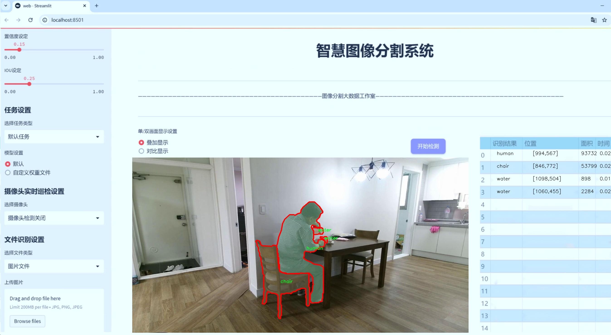
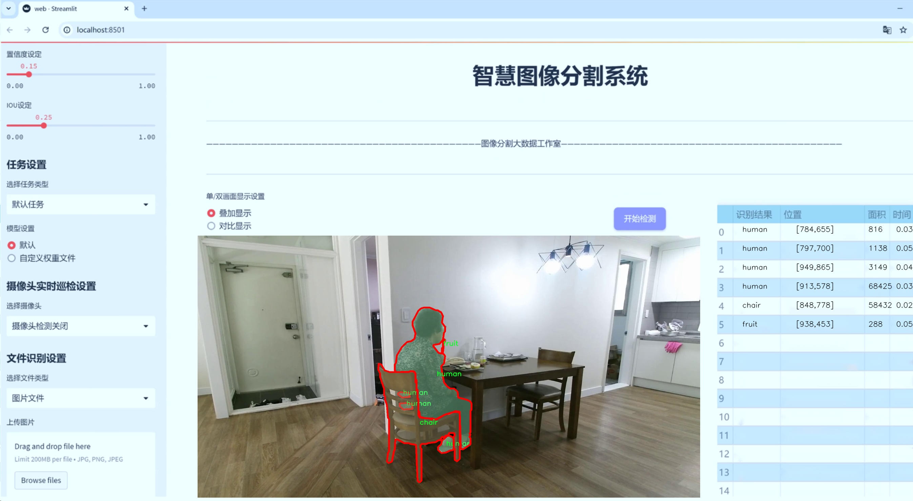
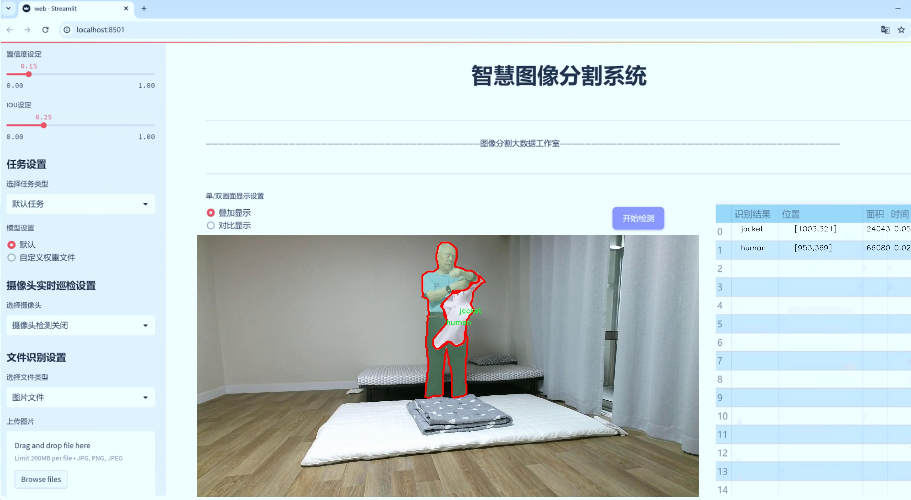
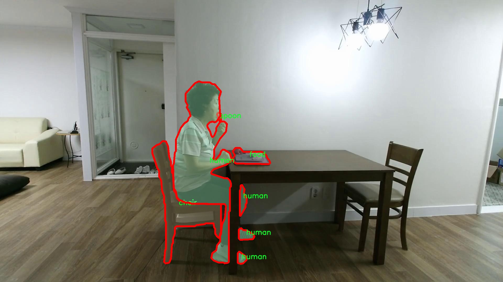
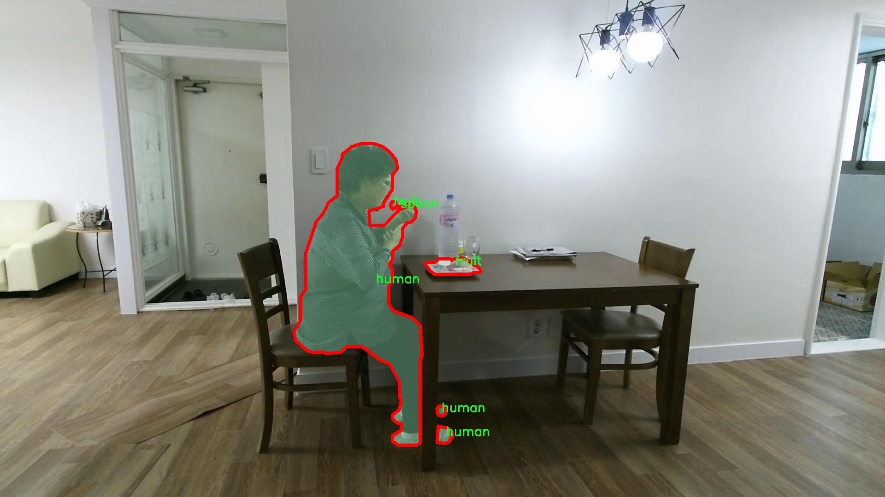
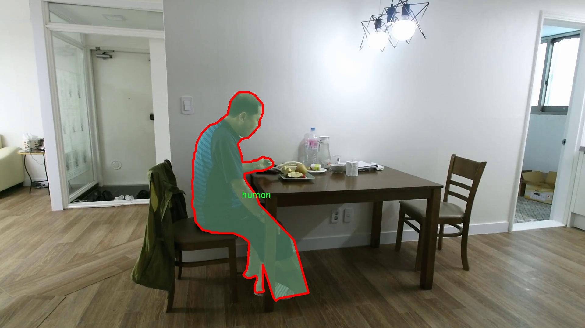
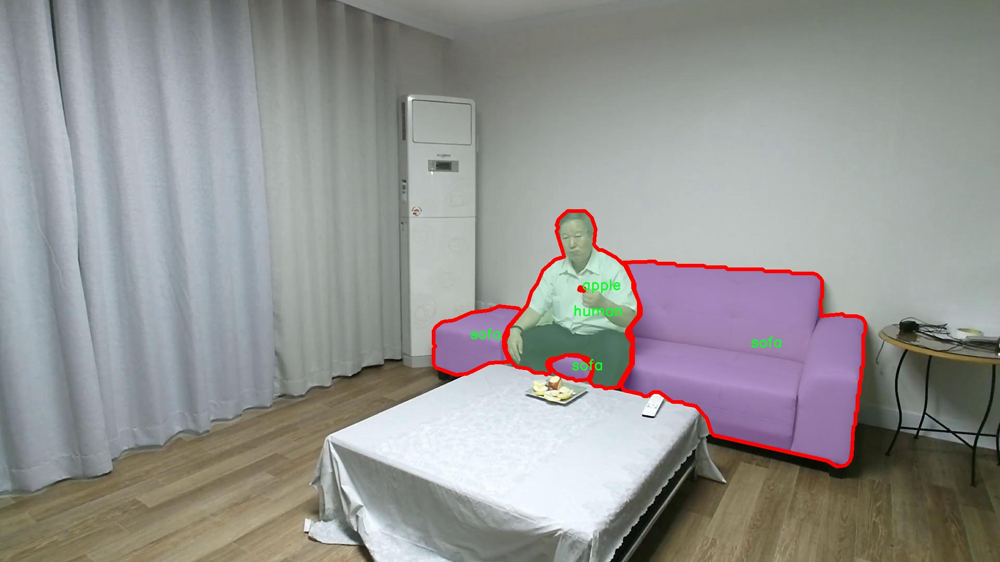
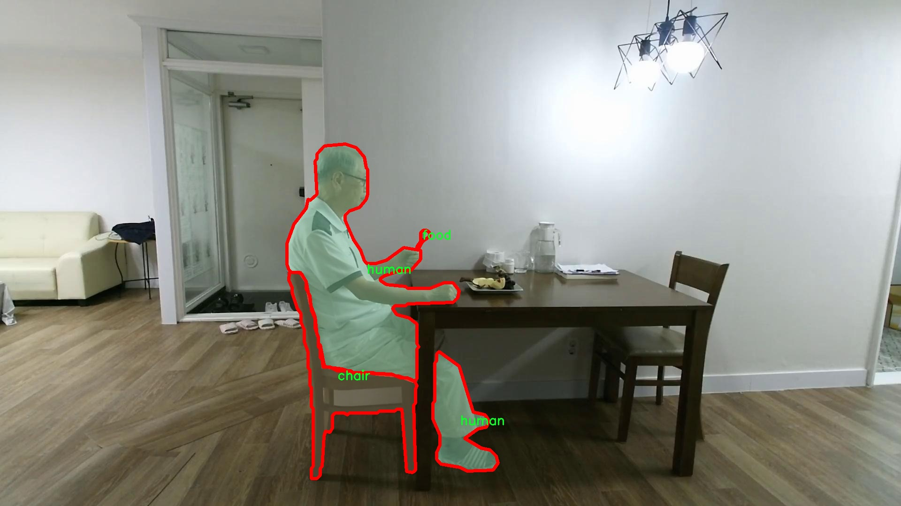

# 日常物品图像分割系统： yolov8-seg-C2f-ContextGuided

### 1.研究背景与意义

[参考博客](https://gitee.com/YOLOv8_YOLOv11_Segmentation_Studio/projects)

[博客来源](https://kdocs.cn/l/cszuIiCKVNis)

研究背景与意义

随着人工智能技术的迅猛发展，计算机视觉领域在物体检测与图像分割方面取得了显著进展。尤其是深度学习算法的引入，使得图像分割的精度和效率得到了极大的提升。YOLO（You Only Look Once）系列模型作为实时物体检测的代表，凭借其高效性和准确性，在多个应用场景中得到了广泛应用。YOLOv8作为该系列的最新版本，进一步优化了模型结构和算法性能，为日常物品的图像分割提供了新的可能性。

在日常生活中，物品的识别与分割不仅对智能家居、自动驾驶等领域具有重要意义，还在增强现实、机器人视觉等新兴应用中扮演着关键角色。通过对日常物品进行准确的图像分割，系统能够更好地理解环境，从而实现更智能的交互与操作。例如，在智能家居中，能够准确识别和分割出家居物品，进而实现智能控制和管理；在自动驾驶中，实时识别和分割周围物体，有助于提高行车安全性和自动驾驶的可靠性。

本研究旨在基于改进的YOLOv8模型，构建一个高效的日常物品图像分割系统。我们将使用一个包含3200张图像和57个类别的丰富数据集，该数据集涵盖了从水果、家具到电子产品等多种日常物品。这种多样性不仅为模型的训练提供了丰富的样本，也使得模型在实际应用中具备更强的泛化能力。通过对这些物品进行精确的实例分割，系统能够实现对不同物体的独立识别与处理，从而提升整体的智能化水平。

此外，日常物品的图像分割系统还具有重要的社会意义。随着人们生活节奏的加快，智能化的需求日益增长，如何提高生活质量、提升工作效率成为了社会关注的焦点。通过本研究所开发的图像分割系统，可以为用户提供更为便捷的生活体验。例如，在购物场景中，用户可以通过图像识别快速找到所需商品；在家庭环境中，智能助手能够识别出家中的物品并提供相应的服务。这不仅能够提高用户的生活便利性，还能够推动智能家居、智能购物等产业的发展。

综上所述，基于改进YOLOv8的日常物品图像分割系统的研究，不仅在技术上具有重要的创新意义，也在实际应用中展现出广阔的前景。通过深入探讨和解决日常物品图像分割中的关键问题，我们希望能够为计算机视觉领域的发展贡献一份力量，同时为智能化生活的实现提供坚实的技术支持。

### 2.图片演示







注意：本项目提供完整的训练源码数据集和训练教程,由于此博客编辑较早,暂不提供权重文件（best.pt）,需要按照6.训练教程进行训练后实现上图效果。

### 3.视频演示

[3.1 视频演示](https://www.bilibili.com/video/BV16kUPY6EKo/)

### 4.数据集信息

##### 4.1 数据集类别数＆类别名

nc: 57
names: ['apple', 'bag', 'bed', 'blanket', 'book', 'bottle', 'bucket', 'cabinet', 'chair', 'chopstick', 'cigarettes', 'cloth', 'comb', 'cosmetics', 'cup', 'dish', 'door', 'floor', 'food', 'fruit', 'glasses', 'hair dryer', 'human', 'jacket', 'jar', 'jug', 'knife', 'laptop', 'lipstick', 'medicine', 'mirror', 'newspaper', 'pan', 'paper', 'pen', 'person1', 'person2', 'phone', 'pot', 'refrigerator', 'remote control', 'shoes', 'sink', 'smartphone', 'sofa', 'spoon', 'stove', 'table', 'telephone', 'tissue', 'toothbrush', 'towel', 'tv', 'vacuum cleaner', 'vegetables', 'water', 'window']


##### 4.2 数据集信息简介

数据集信息展示

在本研究中，我们使用了名为“human”的数据集，旨在训练和改进YOLOv8-seg模型，以实现对日常物品的高效图像分割。该数据集包含57个类别，涵盖了丰富的日常物品，确保了模型在多样化场景中的适应性和准确性。数据集的类别包括但不限于：苹果、包、床、毛毯、书籍、瓶子、桶、橱柜、椅子、筷子、香烟、布料、梳子、化妆品、杯子、盘子、门、地板、食物、水果、眼镜、吹风机、衣服、罐子、壶、刀、笔记本电脑、口红、药品、镜子、报纸、锅、纸张、笔、不同类型的人（person1和person2）、手机、锅、冰箱、遥控器、鞋子、水槽、智能手机、沙发、勺子、炉子、桌子、电话、纸巾、牙刷、毛巾、电视、吸尘器、蔬菜、水和窗户等。

该数据集的设计旨在模拟真实世界中的各种物品，确保模型在处理复杂场景时能够有效识别和分割出各个物体。通过多样化的物品类别，数据集不仅涵盖了家庭环境中常见的物品，还包括一些特定的工具和设备，这为模型的训练提供了广泛的背景信息。例如，厨房用具（如锅、刀、杯子等）和生活用品（如牙刷、毛巾、电视等）都被纳入其中，使得模型能够在不同的上下文中进行准确的物体识别和分割。

此外，数据集中包含的人类对象（如person1和person2）也为模型提供了对人类行为和互动的理解。这种对人类对象的标注使得模型不仅能够识别静态物体，还能在动态场景中进行有效的分割，从而提升了模型在复杂环境中的应用潜力。

在数据预处理阶段，我们对图像进行了标准化处理，以确保模型在训练过程中能够获得一致的输入。这一过程包括图像的缩放、裁剪和增强等操作，以提高模型的鲁棒性和泛化能力。通过对数据集的精心设计和处理，我们期望YOLOv8-seg模型能够在日常物品的图像分割任务中表现出色。

综上所述，“human”数据集的多样性和丰富性为YOLOv8-seg模型的训练提供了坚实的基础。通过对57个类别的深入学习，模型将能够在实际应用中实现高效、准确的图像分割，进而推动智能视觉系统在家庭、商业和工业等多个领域的广泛应用。随着技术的不断进步，我们期待这一数据集能够为未来的研究和应用提供更多的可能性和灵感。











### 5.项目依赖环境部署教程（零基础手把手教学）

[5.1 环境部署教程链接（零基础手把手教学）](https://www.bilibili.com/video/BV1jG4Ve4E9t/?vd_source=bc9aec86d164b67a7004b996143742dc)


[5.2 安装Python虚拟环境创建和依赖库安装视频教程链接（零基础手把手教学）](https://www.bilibili.com/video/BV1nA4VeYEze/?vd_source=bc9aec86d164b67a7004b996143742dc)

### 6.手把手YOLOV8-seg训练视频教程（零基础手把手教学）

[6.1 手把手YOLOV8-seg训练视频教程（零基础小白有手就能学会）](https://www.bilibili.com/video/BV1cA4VeYETe/?vd_source=bc9aec86d164b67a7004b996143742dc)


按照上面的训练视频教程链接加载项目提供的数据集，运行train.py即可开始训练



     Epoch   gpu_mem       box       obj       cls    labels  img_size
     1/200     0G   0.01576   0.01955  0.007536        22      1280: 100%|██████████| 849/849 [14:42<00:00,  1.04s/it]
               Class     Images     Labels          P          R     mAP@.5 mAP@.5:.95: 100%|██████████| 213/213 [01:14<00:00,  2.87it/s]
                 all       3395      17314      0.994      0.957      0.0957      0.0843

     Epoch   gpu_mem       box       obj       cls    labels  img_size
     2/200     0G   0.01578   0.01923  0.007006        22      1280: 100%|██████████| 849/849 [14:44<00:00,  1.04s/it]
               Class     Images     Labels          P          R     mAP@.5 mAP@.5:.95: 100%|██████████| 213/213 [01:12<00:00,  2.95it/s]
                 all       3395      17314      0.996      0.956      0.0957      0.0845

     Epoch   gpu_mem       box       obj       cls    labels  img_size
     3/200     0G   0.01561    0.0191  0.006895        27      1280: 100%|██████████| 849/849 [10:56<00:00,  1.29it/s]
               Class     Images     Labels          P          R     mAP@.5 mAP@.5:.95: 100%|███████   | 187/213 [00:52<00:00,  4.04it/s]
                 all       3395      17314      0.996      0.957      0.0957      0.0845


### 7.50+种全套YOLOV8-seg创新点加载调参实验视频教程（一键加载写好的改进模型的配置文件）

[7.1 50+种全套YOLOV8-seg创新点加载调参实验视频教程（一键加载写好的改进模型的配置文件）](https://www.bilibili.com/video/BV1Hw4VePEXv/?vd_source=bc9aec86d164b67a7004b996143742dc)

### YOLOV8-seg算法简介

原始YOLOv8-seg算法原理

YOLOv8-seg算法是Ultralytics团队在YOLOv5的基础上进行的又一次重要升级，旨在提升目标检测和分割任务的性能。自2023年1月发布以来，YOLOv8-seg通过吸收近两年半内在实际应用中验证的各种改进，展现了更强的鲁棒性和准确性。该算法的设计理念不仅关注于目标检测，还扩展到图像分割任务，标志着YOLO系列模型在计算机视觉领域的进一步发展。

YOLOv8-seg的网络结构分为三个主要部分：Backbone、Neck和Head。Backbone部分主要负责特征提取，采用了一系列卷积和反卷积层，通过残差连接和瓶颈结构来减小网络的大小并提高性能。与之前的YOLO版本相比，YOLOv8-seg在Backbone中引入了C2f模块，取代了传统的C3模块。C2f模块不仅延续了C3模块的设计思路，还结合了YOLOv7中的ELAN（Efficient Layer Aggregation Network）理念，增加了更多的跳层连接。这种设计使得网络能够获得更丰富的梯度流信息，提升了特征提取的效率，同时保持了模型的轻量化。

在Neck部分，YOLOv8-seg采用了多尺度特征融合技术，将来自Backbone不同阶段的特征图进行融合。这一过程使得模型能够更好地捕捉不同尺度目标的信息，从而提高了目标检测和分割的性能与鲁棒性。通过有效整合多层次的特征，YOLOv8-seg能够在处理复杂场景时，依然保持较高的准确率和快速的推理速度。

Head部分是YOLOv8-seg的核心，负责最终的目标检测和分割任务。该部分采用了YOLOX中引入的解耦头设计，设置了两条并行的分支，分别用于提取类别和位置特征。这样的设计理念源于对分类和定位任务的不同需求：分类任务更注重于分析特征图中提取到的特征与已有类别的相似性，而定位任务则关注于边界框与真实框之间的位置关系。通过将这两者分开处理，YOLOv8-seg在收敛速度和预测精度上都有了显著提升。

此外，YOLOv8-seg还引入了无锚框结构，直接预测目标的中心点，并通过任务对齐学习（Task Alignment Learning, TAL）来区分正负样本。这一创新方法通过引入分类分数和IOU（Intersection over Union）的高次幂乘积作为衡量任务对齐程度的指标，确保了在分类和定位损失函数中都能兼顾到良好的定位和分类性能。这种新的损失函数设计使得模型在训练过程中更加高效，能够更好地适应复杂的视觉任务。

在数据增强方面，YOLOv8-seg对Mosaic数据增强策略进行了调整。尽管Mosaic增强在提升模型鲁棒性和泛化性方面表现出色，但其在一定程度上可能会破坏数据的真实分布，导致模型学习到不良信息。因此，YOLOv8-seg在训练的最后10个epoch中停止使用Mosaic数据增强，以确保模型在接近真实数据分布的情况下进行学习，从而提升最终的检测和分割效果。

YOLOv8-seg在性能上也取得了显著的进展。在COCO数据集上的实验结果显示，YOLOv8-seg在相同模型尺寸下，参数量没有显著增加的前提下，取得了比其他模型更好的精度。此外，在推理速度方面，YOLOv8-seg同样表现出色，展示了其在实时应用场景中的潜力。这一系列的改进和优化，使得YOLOv8-seg在垃圾目标检测等实际应用中，能够兼顾实时性和准确性，满足了现代计算机视觉任务的需求。

综上所述，YOLOv8-seg算法通过对网络结构的优化、数据增强策略的调整以及任务对齐学习的引入，展现了在目标检测和分割任务中的强大能力。其轻量化设计和高效的推理性能，使得YOLOv8-seg在实际应用中具有广泛的研究和应用价值，尤其是在需要快速响应和高准确率的场景中，显示出其独特的优势。随着计算机视觉技术的不断发展，YOLOv8-seg无疑将成为未来视觉任务中的重要工具。


### 9.系统功能展示（检测对象为举例，实际内容以本项目数据集为准）

图9.1.系统支持检测结果表格显示

  图9.2.系统支持置信度和IOU阈值手动调节

  图9.3.系统支持自定义加载权重文件best.pt(需要你通过步骤5中训练获得)

  图9.4.系统支持摄像头实时识别

  图9.5.系统支持图片识别

  图9.6.系统支持视频识别

  图9.7.系统支持识别结果文件自动保存

  图9.8.系统支持Excel导出检测结果数据


### 10.50+种全套YOLOV8-seg创新点原理讲解（非科班也可以轻松写刊发刊，V11版本正在科研待更新）

#### 10.1 由于篇幅限制，每个创新点的具体原理讲解就不一一展开，具体见下列网址中的创新点对应子项目的技术原理博客网址【Blog】：


[10.1 50+种全套YOLOV8-seg创新点原理讲解链接](https://gitee.com/qunmasj/good)

#### 10.2 部分改进模块原理讲解(完整的改进原理见上图和技术博客链接)【如果此小节的图加载失败可以通过CSDN或者Github搜索该博客的标题访问原始博客，原始博客图片显示正常】

### YOLOv8简介
YoloV8模型结构
YOLOv3之前的所有YOLO对象检测模型都是用C语言编写的，并使用了Darknet框架，Ultralytics发布了第一个使用PyTorch框架实现的YOLO (YOLOv3)；YOLOv3之后，Ultralytics发布了YOLOv5，在2023年1月，Ultralytics发布了YOLOv8，包含五个模型，用于检测、分割和分类。 YOLOv8 Nano是其中最快和最小的，而YOLOv8 Extra Large (YOLOv8x)是其中最准确但最慢的，具体模型见后续的图。

YOLOv8附带以下预训练模型:

目标检测在图像分辨率为640的COCO检测数据集上进行训练。
实例分割在图像分辨率为640的COCO分割数据集上训练。
图像分类模型在ImageNet数据集上预训练，图像分辨率为224。
YOLOv8 概述
具体到 YOLOv8 算法，其核心特性和改动可以归结为如下：

提供了一个全新的SOTA模型（state-of-the-art model），包括 P5 640 和 P6 1280 分辨率的目标检测网络和基于YOLACT的实例分割模型。和 YOLOv5 一样，基于缩放系数也提供了 N/S/M/L/X 尺度的不同大小模型，用于满足不同场景需求
骨干网络和 Neck 部分可能参考了 YOLOv7 ELAN 设计思想，将 YOLOv5 的 C3 结构换成了梯度流更丰富的 C2f 结构，并对不同尺度模型调整了不同的通道数，属于对模型结构精心微调，不再是一套参数应用所有模型，大幅提升了模型性能。
Head 部分相比 YOLOv5 改动较大，换成了目前主流的解耦头结构，将分类和检测头分离，同时也从Anchor-Based 换成了 Anchor-Free
Loss 计算方面采用了TaskAlignedAssigner正样本分配策略，并引入了Distribution Focal Loss
训练的数据增强部分引入了 YOLOX 中的最后 10 epoch 关闭 Mosiac 增强的操作，可以有效地提升精度


### HRNet V2简介
现在设计高低分辨率融合的思路主要有以下四种：


（a）对称结构。如U-Net、Hourglass等，都是先下采样再上采样，上下采样过程对称。

（b）级联金字塔。如refinenet等，高低分辨率融合时经过卷积处理。

（c）简单的baseline，用转职卷积进行上采样。

（d）扩张卷积。如deeplab等，增大感受野，减少下采样次数，可以无需跳层连接直接进行上采样。

（b）（c）都是使用复杂一些的网络进行下采样（如resnet、vgg），再用轻量级的网络进行上采样。

HRNet V1是在（b）的基础上进行改进，从头到尾保持大的分辨率表示。然而HRNet V1仅是用在姿态估计领域的，HRNet V2对它做小小的改进可以使其适用于更广的视觉任务。这一改进仅仅增加了较小的计算开销，但却提升了较大的准确度。

#### 网络结构图：


这个结构图简洁明了就不多介绍了，首先图2的输入是已经经过下采样四倍的feature map，横向的conv block指的是basicblock 或 bottleblock，不同分辨率之间的多交叉线部分是multi-resolution convolution（多分辨率组卷积）。

到此为止HRNet V2和HRNet V1是完全一致的。

区别之处在于这个基网络上加的一个head：


图3介绍的是接在图2最后的head。（a）是HRNet V1的头，很明显他只用了大分辨率的特征图。（b）（c）是HRNet V2的创新点，（b）用与语义分割，（c）用于目标检测。除此之外作者还在实验部分介绍了用于分类的head，如图4所示。


#### 多分辨率block：


一个多分辨率block由多分辨率组卷积（a）和多分辨率卷积（b）组成。（c）是一个正常卷积的展开，（b）的灵感来源于（c）。代码中（a）部分由Bottleneck和BasicBlock组成。

多分辨率卷积和正常卷积的区别：（1）多分辨率卷积中，每个通道的subset的分辨率都不一样。（2）通道之间的连接如果是降分辨率，则用的是3x3的2stride的卷积，如果是升分辨率，用的是双线性最邻近插值上采样。


### 11.项目核心源码讲解（再也不用担心看不懂代码逻辑）

#### 11.1 ultralytics\engine\validator.py

以下是对代码的核心部分进行提炼和详细注释的结果：

```python
import json
import time
from pathlib import Path
import numpy as np
import torch
from ultralytics.cfg import get_cfg, get_save_dir
from ultralytics.data.utils import check_cls_dataset, check_det_dataset
from ultralytics.nn.autobackend import AutoBackend
from ultralytics.utils import LOGGER, TQDM, callbacks, colorstr, emojis
from ultralytics.utils.checks import check_imgsz
from ultralytics.utils.ops import Profile
from ultralytics.utils.torch_utils import de_parallel, select_device, smart_inference_mode

class BaseValidator:
    """
    BaseValidator 类用于验证模型的准确性。

    属性:
        args (SimpleNamespace): 验证器的配置参数。
        dataloader (DataLoader): 用于验证的数据加载器。
        model (nn.Module): 需要验证的模型。
        device (torch.device): 用于验证的设备。
        speed (dict): 包含预处理、推理、损失和后处理的速度信息。
        save_dir (Path): 保存结果的目录。
    """

    def __init__(self, dataloader=None, save_dir=None, args=None, _callbacks=None):
        """
        初始化 BaseValidator 实例。

        参数:
            dataloader (torch.utils.data.DataLoader): 用于验证的数据加载器。
            save_dir (Path, optional): 保存结果的目录。
            args (SimpleNamespace): 验证器的配置参数。
            _callbacks (dict): 存储各种回调函数的字典。
        """
        self.args = get_cfg(overrides=args)  # 获取配置
        self.dataloader = dataloader  # 数据加载器
        self.model = None  # 模型初始化为 None
        self.device = None  # 设备初始化为 None
        self.save_dir = save_dir or get_save_dir(self.args)  # 设置保存目录
        self.speed = {'preprocess': 0.0, 'inference': 0.0, 'loss': 0.0, 'postprocess': 0.0}  # 初始化速度字典
        self.callbacks = _callbacks or callbacks.get_default_callbacks()  # 初始化回调函数

    @smart_inference_mode()
    def __call__(self, trainer=None, model=None):
        """支持验证预训练模型或正在训练的模型。"""
        self.training = trainer is not None  # 判断是否在训练模式
        if self.training:
            self.device = trainer.device  # 获取训练设备
            model = trainer.ema.ema or trainer.model  # 获取模型
            model.eval()  # 设置模型为评估模式
        else:
            model = AutoBackend(model or self.args.model, device=select_device(self.args.device, self.args.batch))  # 自动选择后端
            self.device = model.device  # 更新设备

        self.dataloader = self.dataloader or self.get_dataloader(self.args.data, self.args.batch)  # 获取数据加载器
        model.eval()  # 设置模型为评估模式

        for batch_i, batch in enumerate(TQDM(self.dataloader, desc='Validating')):
            # 预处理
            batch = self.preprocess(batch)

            # 推理
            preds = model(batch['img'])

            # 更新指标
            self.update_metrics(preds, batch)

        stats = self.get_stats()  # 获取统计信息
        self.print_results()  # 打印结果
        return stats  # 返回统计信息

    def preprocess(self, batch):
        """对输入批次进行预处理。"""
        return batch  # 返回处理后的批次

    def update_metrics(self, preds, batch):
        """根据预测结果和批次更新指标。"""
        pass  # 具体实现由子类定义

    def get_stats(self):
        """返回模型性能的统计信息。"""
        return {}  # 返回空字典，具体实现由子类定义

    def print_results(self):
        """打印模型预测的结果。"""
        pass  # 具体实现由子类定义

    def get_dataloader(self, dataset_path, batch_size):
        """从数据集路径和批次大小获取数据加载器。"""
        raise NotImplementedError('get_dataloader function not implemented for this validator')  # 抛出未实现异常
```

### 代码分析与注释

1. **导入模块**：引入了必要的库和模块，包括 `torch`、`numpy` 和一些自定义的工具模块。

2. **BaseValidator 类**：这是一个基类，用于验证模型的准确性。它包含了初始化、数据加载、模型推理等核心功能。

3. **初始化方法 `__init__`**：设置了验证器的基本配置，包括数据加载器、保存目录、速度统计和回调函数。

4. **调用方法 `__call__`**：该方法支持验证预训练模型或正在训练的模型。它处理模型的设置、数据加载和验证过程。

5. **预处理方法 `preprocess`**：对输入的批次进行预处理，目前简单返回原始批次，具体处理逻辑可以在子类中实现。

6. **更新指标方法 `update_metrics`**：根据模型的预测结果和输入批次更新性能指标，具体实现由子类定义。

7. **获取统计信息方法 `get_stats`**：返回模型性能的统计信息，当前返回空字典，具体实现由子类定义。

8. **打印结果方法 `print_results`**：打印模型的预测结果，当前没有实现，具体逻辑可以在子类中定义。

9. **获取数据加载器方法 `get_dataloader`**：用于从数据集路径和批次大小获取数据加载器，抛出未实现异常，提示需要在子类中实现。

这个类的设计为后续的具体验证器（如目标检测、分类等）提供了基础框架，子类可以根据具体需求实现相应的方法。

这个文件是Ultralytics YOLO框架中的一个验证器类（`BaseValidator`），用于评估模型在测试集或验证集上的准确性。该类的设计目的是为模型的验证过程提供一个基础框架，包含了多种功能和属性，以便于在不同的任务中进行模型评估。

在文件开头，首先提供了使用该验证器的示例命令，说明了如何通过命令行调用YOLO模型进行验证。接着，导入了一些必要的库和模块，包括用于数据处理、模型管理和日志记录的工具。

`BaseValidator`类的构造函数初始化了一些重要的属性，包括配置参数、数据加载器、模型、设备信息等。构造函数中还会根据提供的参数设置一些默认值，并创建保存结果的目录。

`__call__`方法是该类的核心，支持对预训练模型或正在训练的模型进行验证。根据传入的参数，方法会设置训练模式或推理模式，并初始化模型和数据加载器。接着，模型会进行热身以提高推理速度。

在验证过程中，使用了一个进度条来显示当前的验证进度。每个批次的数据会经过预处理、推理、损失计算和后处理等步骤，最后更新模型的性能指标。验证完成后，统计结果会被打印出来，并根据需要保存为JSON格式。

该类还提供了一些辅助方法，例如匹配预测结果与真实标签、添加回调函数、获取数据加载器等。这些方法使得验证过程更加灵活和可扩展。

此外，`BaseValidator`类中定义了一些占位符方法（如`get_dataloader`、`build_dataset`等），这些方法需要在子类中实现，以适应具体的验证需求。

总体来说，这个文件提供了一个结构化的框架，用于在YOLO模型中进行验证，涵盖了从数据加载到结果输出的整个过程，具有良好的可扩展性和灵活性。

#### 11.2 ultralytics\utils\dist.py

以下是代码中最核心的部分，并附上详细的中文注释：

```python
import os
import re
import shutil
import socket
import sys
import tempfile
from pathlib import Path

def find_free_network_port() -> int:
    """
    查找本地主机上可用的端口。

    在单节点训练时，如果不想连接到真实的主节点，但必须设置
    `MASTER_PORT` 环境变量时，这个函数非常有用。
    """
    with socket.socket(socket.AF_INET, socket.SOCK_STREAM) as s:
        s.bind(('127.0.0.1', 0))  # 绑定到本地地址和随机端口
        return s.getsockname()[1]  # 返回分配的端口号


def generate_ddp_file(trainer):
    """生成 DDP 文件并返回其文件名。"""
    # 获取训练器的模块和类名
    module, name = f'{trainer.__class__.__module__}.{trainer.__class__.__name__}'.rsplit('.', 1)

    # 构建 DDP 文件的内容
    content = f'''overrides = {vars(trainer.args)} \nif __name__ == "__main__":
    from {module} import {name}
    from ultralytics.utils import DEFAULT_CFG_DICT

    cfg = DEFAULT_CFG_DICT.copy()
    cfg.update(save_dir='')   # 处理额外的键 'save_dir'
    trainer = {name}(cfg=cfg, overrides=overrides)
    trainer.train()'''
    
    # 创建 DDP 目录（如果不存在）
    (USER_CONFIG_DIR / 'DDP').mkdir(exist_ok=True)
    
    # 创建临时文件并写入内容
    with tempfile.NamedTemporaryFile(prefix='_temp_',
                                     suffix=f'{id(trainer)}.py',
                                     mode='w+',
                                     encoding='utf-8',
                                     dir=USER_CONFIG_DIR / 'DDP',
                                     delete=False) as file:
        file.write(content)  # 写入内容到临时文件
    return file.name  # 返回临时文件的名称


def generate_ddp_command(world_size, trainer):
    """生成并返回用于分布式训练的命令。"""
    import __main__  # 本地导入以避免某些问题
    if not trainer.resume:
        shutil.rmtree(trainer.save_dir)  # 如果不恢复训练，删除保存目录
    
    file = str(Path(sys.argv[0]).resolve())  # 获取当前脚本的绝对路径
    safe_pattern = re.compile(r'^[a-zA-Z0-9_. /\\-]{1,128}$')  # 允许的字符和最大长度
    # 检查文件名是否合法且存在，并且以 .py 结尾
    if not (safe_pattern.match(file) and Path(file).exists() and file.endswith('.py')):
        file = generate_ddp_file(trainer)  # 生成 DDP 文件
    
    # 根据 PyTorch 版本选择分布式命令
    dist_cmd = 'torch.distributed.run' if TORCH_1_9 else 'torch.distributed.launch'
    port = find_free_network_port()  # 查找可用端口
    # 构建命令列表
    cmd = [sys.executable, '-m', dist_cmd, '--nproc_per_node', f'{world_size}', '--master_port', f'{port}', file]
    return cmd, file  # 返回命令和文件名


def ddp_cleanup(trainer, file):
    """如果创建了临时文件，则删除它。"""
    if f'{id(trainer)}.py' in file:  # 检查文件名中是否包含临时文件的后缀
        os.remove(file)  # 删除临时文件
```

### 代码核心功能概述：
1. **查找可用端口**：`find_free_network_port` 函数用于查找本地主机上可用的网络端口，适用于设置分布式训练的环境变量。
2. **生成 DDP 文件**：`generate_ddp_file` 函数生成一个用于分布式数据并行（DDP）训练的 Python 文件，并返回该文件的路径。
3. **生成训练命令**：`generate_ddp_command` 函数根据训练器的状态和系统环境生成用于启动分布式训练的命令。
4. **清理临时文件**：`ddp_cleanup` 函数用于删除在训练过程中生成的临时文件，以保持文件系统的整洁。

这个程序文件 `ultralytics/utils/dist.py` 是用于支持分布式训练的工具模块，主要涉及到一些网络端口的管理、生成分布式训练的命令和清理临时文件等功能。

首先，文件导入了一些必要的库，包括操作系统相关的库、正则表达式库、套接字库、系统库、临时文件库以及路径处理库。它还导入了用户配置目录和一个与 PyTorch 版本相关的常量。

`find_free_network_port` 函数用于查找本地主机上一个可用的网络端口。这在单节点训练时非常有用，因为我们不想连接到真实的主节点，但需要设置 `MASTER_PORT` 环境变量。该函数通过创建一个套接字并绑定到一个随机端口来实现，返回该端口号。

`generate_ddp_file` 函数用于生成一个 DDP（Distributed Data Parallel）文件，并返回其文件名。它从传入的训练器对象中提取类的模块和名称，并构建一个包含训练参数的 Python 脚本内容。接着，它在用户配置目录下创建一个名为 `DDP` 的文件夹（如果不存在的话），并将生成的内容写入一个临时文件中，最后返回该文件的名称。

`generate_ddp_command` 函数生成并返回用于分布式训练的命令。它首先检查训练器是否需要恢复，如果不需要，则删除保存目录。接着，它获取当前脚本的路径，并通过正则表达式检查该路径是否安全。如果路径不符合要求，则调用 `generate_ddp_file` 生成一个临时文件。然后，它确定使用的分布式命令（根据 PyTorch 版本选择 `torch.distributed.run` 或 `torch.distributed.launch`），并调用 `find_free_network_port` 获取一个可用的端口。最后，它构建并返回一个包含执行命令的列表和临时文件名。

`ddp_cleanup` 函数用于在训练结束后删除临时文件。如果临时文件的后缀与训练器的 ID 匹配，则执行删除操作，以确保清理不再需要的文件。

总体来说，这个模块为 Ultralytics YOLO 提供了分布式训练的支持，简化了分布式训练环境的设置和管理。

#### 11.3 demo_test_image.py

以下是代码中最核心的部分，并附上详细的中文注释：

```python
import cv2
import numpy as np
from PIL import ImageFont, ImageDraw, Image
from hashlib import md5
from model import Web_Detector
from chinese_name_list import Label_list

def generate_color_based_on_name(name):
    # 使用哈希函数生成稳定的颜色
    hash_object = md5(name.encode())  # 对名字进行MD5哈希
    hex_color = hash_object.hexdigest()[:6]  # 取前6位16进制数
    r, g, b = int(hex_color[0:2], 16), int(hex_color[2:4], 16), int(hex_color[4:6], 16)  # 转换为RGB
    return (b, g, r)  # OpenCV 使用BGR格式

def draw_with_chinese(image, text, position, font_size=20, color=(255, 0, 0)):
    # 在图像上绘制中文文本
    image_pil = Image.fromarray(cv2.cvtColor(image, cv2.COLOR_BGR2RGB))  # 转换为PIL格式
    draw = ImageDraw.Draw(image_pil)  # 创建绘图对象
    font = ImageFont.truetype("simsun.ttc", font_size, encoding="unic")  # 加载中文字体
    draw.text(position, text, font=font, fill=color)  # 绘制文本
    return cv2.cvtColor(np.array(image_pil), cv2.COLOR_RGB2BGR)  # 转换回OpenCV格式

def draw_detections(image, info):
    # 绘制检测结果，包括边框、类别名称等
    name, bbox = info['class_name'], info['bbox']  # 获取类别名称和边界框
    x1, y1, x2, y2 = bbox  # 解包边界框坐标
    cv2.rectangle(image, (x1, y1), (x2, y2), color=(0, 0, 255), thickness=3)  # 绘制边界框
    image = draw_with_chinese(image, name, (x1, y1 - 10), font_size=20)  # 绘制类别名称
    return image

def process_frame(model, image):
    # 处理图像帧，进行目标检测
    pre_img = model.preprocess(image)  # 预处理图像
    pred = model.predict(pre_img)  # 进行预测
    det = pred[0]  # 获取检测结果

    if det is not None and len(det):
        det_info = model.postprocess(pred)  # 后处理，获取检测信息
        for info in det_info:
            image = draw_detections(image, info)  # 绘制检测结果
    return image

if __name__ == "__main__":
    model = Web_Detector()  # 创建模型实例
    model.load_model("./weights/yolov8s-seg.pt")  # 加载模型权重

    # 图片处理
    image_path = './icon/OIP.jpg'  # 指定图片路径
    image = cv2.imread(image_path)  # 读取图片
    if image is not None:
        processed_image = process_frame(model, image)  # 处理图像
        cv2.imshow('Processed Image', processed_image)  # 显示处理后的图像
        cv2.waitKey(0)  # 等待按键
        cv2.destroyAllWindows()  # 关闭窗口
    else:
        print('Image not found.')  # 图片未找到的提示
```

### 代码核心部分说明：
1. **生成颜色**：`generate_color_based_on_name` 函数使用MD5哈希生成一个稳定的颜色，确保相同的名字总是得到相同的颜色。
2. **绘制中文文本**：`draw_with_chinese` 函数在图像上绘制中文文本，使用PIL库处理中文字体。
3. **绘制检测结果**：`draw_detections` 函数负责在图像上绘制检测到的目标，包括边界框和类别名称。
4. **处理图像帧**：`process_frame` 函数对输入图像进行预处理、预测和后处理，最终返回绘制了检测结果的图像。
5. **主程序**：在主程序中加载模型并读取图像，调用处理函数进行目标检测并显示结果。

这个程序文件 `demo_test_image.py` 是一个图像处理脚本，主要用于使用深度学习模型进行目标检测和分割，并在图像上绘制检测结果。程序中使用了 OpenCV、NumPy 和 PIL 等库来处理图像和绘制文本。

首先，程序导入了必要的库，包括随机数生成、图像处理、数组操作、字体处理、哈希函数以及自定义的模型和标签列表。接着，定义了几个辅助函数。

`generate_color_based_on_name(name)` 函数使用 MD5 哈希函数根据输入的名称生成一个稳定的颜色值。这个颜色值用于在图像中标识不同的目标。

`calculate_polygon_area(points)` 函数计算给定点集（多边形）的面积，使用 OpenCV 的 `contourArea` 函数。

`draw_with_chinese(image, text, position, font_size=20, color=(255, 0, 0))` 函数用于在图像上绘制中文文本。它将 OpenCV 图像转换为 PIL 图像，以便使用指定的字体和颜色绘制文本，然后再转换回 OpenCV 格式。

`adjust_parameter(image_size, base_size=1000)` 函数根据图像的大小调整参数，以便在绘制时保持一致的比例。

`draw_detections(image, info, alpha=0.2)` 函数负责在图像上绘制检测到的目标，包括边界框、类别名称和其他信息。如果检测到的目标有掩码，则绘制掩码并计算相关的几何特征（如面积、周长和圆度），并在图像上显示这些信息。

`process_frame(model, image)` 函数处理输入图像，首先对图像进行预处理，然后使用模型进行预测，最后将检测到的目标绘制到图像上。

在主程序部分，首先加载标签列表和模型，然后读取指定路径的图像。如果图像成功加载，则调用 `process_frame` 函数处理图像，并使用 OpenCV 显示处理后的图像。如果图像未找到，则输出错误信息。

整体而言，这个程序的目的是通过深度学习模型对图像进行目标检测，并在图像上可视化检测结果，适合用于计算机视觉相关的应用。

#### 11.4 train.py

以下是经过简化并添加详细中文注释的核心代码部分：

```python
import os
import torch
import yaml
from ultralytics import YOLO  # 导入YOLO模型库

if __name__ == '__main__':  # 确保该模块被直接运行时才执行以下代码
    # 设置训练参数
    workers = 1  # 数据加载的工作进程数
    batch = 8  # 每个批次的样本数量
    device = "0" if torch.cuda.is_available() else "cpu"  # 判断是否使用GPU

    # 获取数据集配置文件的绝对路径
    data_path = abs_path(f'datasets/data/data.yaml', path_type='current')

    # 读取YAML文件，保持原有顺序
    with open(data_path, 'r') as file:
        data = yaml.load(file, Loader=yaml.FullLoader)

    # 修改数据集中训练、验证和测试集的路径
    if 'train' in data and 'val' in data and 'test' in data:
        directory_path = os.path.dirname(data_path)  # 获取数据集目录路径
        data['train'] = os.path.join(directory_path, 'train')  # 更新训练集路径
        data['val'] = os.path.join(directory_path, 'val')  # 更新验证集路径
        data['test'] = os.path.join(directory_path, 'test')  # 更新测试集路径

        # 将修改后的数据写回YAML文件
        with open(data_path, 'w') as file:
            yaml.safe_dump(data, file, sort_keys=False)

    # 加载YOLO模型，指定配置文件和预训练权重
    model = YOLO(r"C:\codeseg\codenew\50+种YOLOv8算法改进源码大全和调试加载训练教程（非必要）\改进YOLOv8模型配置文件\yolov8-seg-C2f-Faster.yaml").load("./weights/yolov8s-seg.pt")

    # 开始训练模型
    results = model.train(
        data=data_path,  # 指定训练数据的配置文件路径
        device=device,  # 使用指定的设备进行训练
        workers=workers,  # 指定数据加载的工作进程数
        imgsz=640,  # 输入图像的大小为640x640
        epochs=100,  # 训练100个epoch
        batch=batch,  # 每个批次的大小为8
    )
```

### 代码说明：
1. **导入库**：导入必要的库，包括操作系统库、PyTorch、YAML解析库和YOLO模型库。
2. **主程序入口**：使用`if __name__ == '__main__':`确保只有在直接运行该脚本时才执行以下代码。
3. **设置训练参数**：定义数据加载的工作进程数、批次大小和设备（GPU或CPU）。
4. **获取数据集配置文件路径**：使用`abs_path`函数获取数据集配置文件的绝对路径。
5. **读取和修改YAML文件**：读取YAML文件内容，更新训练、验证和测试集的路径，并将修改后的内容写回文件。
6. **加载YOLO模型**：指定模型的配置文件和预训练权重，加载YOLO模型。
7. **训练模型**：调用`model.train`方法开始训练，传入训练数据路径、设备、工作进程数、图像大小、训练轮数和批次大小等参数。

该程序文件 `train.py` 是一个用于训练 YOLO（You Only Look Once）模型的脚本。首先，程序导入了必要的库，包括操作系统库 `os`、深度学习框架 `torch`、YAML 处理库 `yaml` 以及 YOLO 模型库 `ultralytics`。此外，还导入了 `matplotlib` 库用于图形显示。

在 `__main__` 块中，程序首先设置了一些训练参数，包括工作进程数 `workers`、批次大小 `batch`、以及设备类型 `device`。设备类型会根据是否有可用的 GPU 自动选择，如果有可用的 GPU，则使用 GPU（设备编号为 "0"），否则使用 CPU。

接下来，程序构建了数据集配置文件的绝对路径，并将路径格式转换为 Unix 风格，以便后续处理。通过读取指定的 YAML 文件，程序获取数据集的相关信息，并修改其中的 `train`、`val` 和 `test` 路径为当前目录下的相应子目录。修改完成后，程序将更新后的数据写回到 YAML 文件中。

在模型加载部分，程序创建了一个 YOLO 模型实例，并加载了指定的模型配置文件和预训练权重。用户可以根据需要选择不同的模型配置文件，以适应不同的硬件要求。

最后，程序调用 `model.train()` 方法开始训练模型，传入了训练数据的配置文件路径、设备类型、工作进程数、输入图像大小、训练轮数（epochs）以及批次大小等参数。训练过程将使用这些参数来优化模型性能。

总体而言，该脚本提供了一个完整的流程，从数据准备到模型训练，适合用于深度学习任务中的目标检测或分割任务。

#### 11.5 ultralytics\data\dataset.py

以下是代码中最核心的部分，并附上详细的中文注释：

```python
import numpy as np
import torch
from pathlib import Path
from ultralytics.utils import TQDM, LOGGER, get_hash, img2label_paths, verify_image_label

# Ultralytics 数据集缓存版本，>= 1.0.0 用于 YOLOv8
DATASET_CACHE_VERSION = '1.0.3'

class YOLODataset:
    """
    YOLO 数据集类，用于加载 YOLO 格式的目标检测和/或分割标签。

    参数:
        data (dict, optional): 数据集的 YAML 字典。默认为 None。
        use_segments (bool, optional): 如果为 True，则使用分割掩码作为标签。默认为 False。
        use_keypoints (bool, optional): 如果为 True，则使用关键点作为标签。默认为 False。
    """

    def __init__(self, data=None, use_segments=False, use_keypoints=False):
        """初始化 YOLODataset，设置分割和关键点的可选配置。"""
        self.use_segments = use_segments
        self.use_keypoints = use_keypoints
        self.data = data
        assert not (self.use_segments and self.use_keypoints), '不能同时使用分割和关键点。'

    def cache_labels(self, path=Path('./labels.cache')):
        """
        缓存数据集标签，检查图像并读取形状。

        参数:
            path (Path): 保存缓存文件的路径（默认: Path('./labels.cache')）。
        返回:
            (dict): 标签字典。
        """
        x = {'labels': []}  # 初始化标签字典
        nm, nf, ne, nc, msgs = 0, 0, 0, 0, []  # 统计缺失、找到、空、损坏的图像数量和消息
        total = len(self.im_files)  # 图像文件总数

        # 使用多线程验证图像和标签
        with ThreadPool(NUM_THREADS) as pool:
            results = pool.imap(func=verify_image_label,
                                iterable=zip(self.im_files, self.label_files))
            pbar = TQDM(results, desc='扫描中...', total=total)  # 显示进度条
            for im_file, lb, shape, segments, keypoint, nm_f, nf_f, ne_f, nc_f, msg in pbar:
                nm += nm_f
                nf += nf_f
                ne += ne_f
                nc += nc_f
                if im_file:
                    x['labels'].append(
                        dict(
                            im_file=im_file,
                            shape=shape,
                            cls=lb[:, 0:1],  # 类别
                            bboxes=lb[:, 1:],  # 边界框
                            segments=segments,
                            keypoints=keypoint,
                            normalized=True,
                            bbox_format='xywh'))  # 边界框格式
                if msg:
                    msgs.append(msg)
                pbar.desc = f'扫描中... {nf} 张图像, {nm + ne} 背景, {nc} 损坏'

        if msgs:
            LOGGER.info('\n'.join(msgs))  # 记录警告信息
        x['hash'] = get_hash(self.label_files + self.im_files)  # 计算标签和图像文件的哈希值
        save_dataset_cache_file('YOLODataset', path, x)  # 保存缓存文件
        return x

    def get_labels(self):
        """返回 YOLO 训练的标签字典。"""
        self.label_files = img2label_paths(self.im_files)  # 获取标签文件路径
        cache_path = Path(self.label_files[0]).parent.with_suffix('.cache')  # 缓存文件路径
        try:
            cache, exists = load_dataset_cache_file(cache_path), True  # 尝试加载缓存文件
            assert cache['version'] == DATASET_CACHE_VERSION  # 检查版本
            assert cache['hash'] == get_hash(self.label_files + self.im_files)  # 检查哈希值
        except (FileNotFoundError, AssertionError):
            cache, exists = self.cache_labels(cache_path), False  # 如果加载失败，则缓存标签

        # 处理缓存结果
        labels = cache['labels']
        if not labels:
            LOGGER.warning(f'警告 ⚠️ 在 {cache_path} 中未找到图像，训练可能无法正常工作。')
        self.im_files = [lb['im_file'] for lb in labels]  # 更新图像文件列表
        return labels

    @staticmethod
    def collate_fn(batch):
        """将数据样本合并为批次。"""
        new_batch = {}
        keys = batch[0].keys()
        values = list(zip(*[list(b.values()) for b in batch]))
        for i, k in enumerate(keys):
            value = values[i]
            if k == 'img':
                value = torch.stack(value, 0)  # 将图像堆叠成一个张量
            if k in ['masks', 'keypoints', 'bboxes', 'cls']:
                value = torch.cat(value, 0)  # 将掩码、关键点、边界框和类别合并
            new_batch[k] = value
        return new_batch

def load_dataset_cache_file(path):
    """从路径加载 Ultralytics *.cache 字典。"""
    cache = np.load(str(path), allow_pickle=True).item()  # 加载缓存字典
    return cache

def save_dataset_cache_file(prefix, path, x):
    """将 Ultralytics 数据集 *.cache 字典 x 保存到路径。"""
    x['version'] = DATASET_CACHE_VERSION  # 添加缓存版本
    if path.exists():
        path.unlink()  # 如果缓存文件存在，则删除
    np.save(str(path), x)  # 保存缓存
    LOGGER.info(f'{prefix} 新缓存已创建: {path}')  # 记录缓存创建信息
```

### 代码核心部分说明：
1. **YOLODataset 类**：这是一个用于处理 YOLO 格式数据集的类，包含初始化、标签缓存、获取标签和合并批次等方法。
2. **cache_labels 方法**：用于缓存数据集标签，检查图像的有效性，并读取图像的形状信息。
3. **get_labels 方法**：获取标签信息，支持从缓存中加载标签。
4. **collate_fn 方法**：用于将多个样本合并为一个批次，适用于 PyTorch 数据加载器。
5. **load_dataset_cache_file 和 save_dataset_cache_file 方法**：用于加载和保存数据集的缓存文件，以提高数据加载效率。

这个程序文件主要定义了用于YOLO（You Only Look Once）目标检测和分类的两个数据集类：`YOLODataset`和`ClassificationDataset`，以及一些辅助函数和类。

`YOLODataset`类用于加载YOLO格式的目标检测和分割标签。它的构造函数接收一些参数，包括数据字典、是否使用分割掩码和关键点。该类通过继承`BaseDataset`来实现基本的数据集功能。`cache_labels`方法用于缓存数据集标签，检查图像并读取其形状。它使用多线程来提高处理速度，并在处理过程中提供进度条显示。`get_labels`方法则用于返回YOLO训练所需的标签字典，支持从缓存文件中加载标签，若缓存不存在或不匹配，则会重新生成标签并缓存。

`build_transforms`方法构建数据增强变换，包括mosaic、mixup等操作，适用于训练时的图像处理。`update_labels_info`方法用于自定义标签格式，将边界框、分割和关键点信息整合为一个`Instances`对象。`collate_fn`方法则用于将多个样本合并为一个批次，方便在训练过程中进行批量处理。

`ClassificationDataset`类用于处理YOLO分类数据集，继承自`torchvision.datasets.ImageFolder`。它的构造函数接收数据集路径、参数设置、增强选项和缓存设置。该类提供了图像的读取和预处理功能，包括缓存图像到内存或磁盘的选项。`__getitem__`方法返回指定索引的样本和目标，`__len__`方法返回数据集的总样本数。`verify_images`方法用于验证数据集中所有图像的有效性，并在必要时生成缓存。

此外，文件中还定义了两个辅助函数：`load_dataset_cache_file`和`save_dataset_cache_file`，分别用于加载和保存数据集的缓存文件。这些函数通过使用NumPy来处理缓存文件的读写操作。

最后，`SemanticDataset`类是一个占位符，未来将用于处理语义分割任务，目前尚未实现具体的方法和属性。整体来看，这个文件为YOLO模型的训练提供了必要的数据集管理和处理功能。

### 12.系统整体结构（节选）

### 程序整体功能和构架概括

该程序是一个用于目标检测和分类的深度学习框架，主要基于YOLO（You Only Look Once）模型。程序的整体结构分为多个模块，每个模块负责特定的功能，形成一个完整的训练、验证和推理流程。主要功能包括：

1. **数据集管理**：通过 `dataset.py` 提供数据集的加载、预处理和增强功能，支持YOLO格式的目标检测和分类任务。
2. **模型训练**：通过 `train.py` 脚本实现模型的训练过程，支持自定义参数设置和模型配置。
3. **模型验证**：通过 `validator.py` 提供模型验证的框架，评估模型在验证集上的性能。
4. **分布式训练支持**：通过 `dist.py` 提供分布式训练的工具，支持多GPU训练。
5. **推理和可视化**：通过 `demo_test_image.py` 实现对输入图像的推理，并可视化检测结果。

这些模块共同构成了一个灵活且可扩展的目标检测框架，适用于多种计算机视觉任务。

### 文件功能整理表

| 文件路径                                      | 功能描述                                                                                       |
|-------------------------------------------|----------------------------------------------------------------------------------------------|
| `ultralytics/engine/validator.py`       | 提供模型验证的框架，支持评估模型在验证集上的性能，包含数据加载、推理和结果输出等功能。               |
| `ultralytics/utils/dist.py`              | 支持分布式训练的工具，提供查找可用网络端口、生成分布式训练命令和清理临时文件的功能。                 |
| `demo_test_image.py`                     | 实现对输入图像的目标检测和分割，绘制检测结果并可视化，适用于推理和展示模型性能。                   |
| `train.py`                               | 实现YOLO模型的训练过程，支持自定义参数设置和模型配置，负责数据集的加载和训练的启动。               |
| `ultralytics/data/dataset.py`           | 定义数据集类（如`YOLODataset`和`ClassificationDataset`），负责数据的加载、预处理和增强功能。         |

通过这些模块的协作，用户可以方便地进行目标检测任务的训练、验证和推理，适应不同的应用场景和需求。

### 13.图片、视频、摄像头图像分割Demo(去除WebUI)代码

在这个博客小节中，我们将讨论如何在不使用WebUI的情况下，实现图像分割模型的使用。本项目代码已经优化整合，方便用户将分割功能嵌入自己的项目中。
核心功能包括图片、视频、摄像头图像的分割，ROI区域的轮廓提取、类别分类、周长计算、面积计算、圆度计算以及颜色提取等。
这些功能提供了良好的二次开发基础。

### 核心代码解读

以下是主要代码片段，我们会为每一块代码进行详细的批注解释：

```python
import random
import cv2
import numpy as np
from PIL import ImageFont, ImageDraw, Image
from hashlib import md5
from model import Web_Detector
from chinese_name_list import Label_list

# 根据名称生成颜色
def generate_color_based_on_name(name):
    ......

# 计算多边形面积
def calculate_polygon_area(points):
    return cv2.contourArea(points.astype(np.float32))

...
# 绘制中文标签
def draw_with_chinese(image, text, position, font_size=20, color=(255, 0, 0)):
    image_pil = Image.fromarray(cv2.cvtColor(image, cv2.COLOR_BGR2RGB))
    draw = ImageDraw.Draw(image_pil)
    font = ImageFont.truetype("simsun.ttc", font_size, encoding="unic")
    draw.text(position, text, font=font, fill=color)
    return cv2.cvtColor(np.array(image_pil), cv2.COLOR_RGB2BGR)

# 动态调整参数
def adjust_parameter(image_size, base_size=1000):
    max_size = max(image_size)
    return max_size / base_size

# 绘制检测结果
def draw_detections(image, info, alpha=0.2):
    name, bbox, conf, cls_id, mask = info['class_name'], info['bbox'], info['score'], info['class_id'], info['mask']
    adjust_param = adjust_parameter(image.shape[:2])
    spacing = int(20 * adjust_param)

    if mask is None:
        x1, y1, x2, y2 = bbox
        aim_frame_area = (x2 - x1) * (y2 - y1)
        cv2.rectangle(image, (x1, y1), (x2, y2), color=(0, 0, 255), thickness=int(3 * adjust_param))
        image = draw_with_chinese(image, name, (x1, y1 - int(30 * adjust_param)), font_size=int(35 * adjust_param))
        y_offset = int(50 * adjust_param)  # 类别名称上方绘制，其下方留出空间
    else:
        mask_points = np.concatenate(mask)
        aim_frame_area = calculate_polygon_area(mask_points)
        mask_color = generate_color_based_on_name(name)
        try:
            overlay = image.copy()
            cv2.fillPoly(overlay, [mask_points.astype(np.int32)], mask_color)
            image = cv2.addWeighted(overlay, 0.3, image, 0.7, 0)
            cv2.drawContours(image, [mask_points.astype(np.int32)], -1, (0, 0, 255), thickness=int(8 * adjust_param))

            # 计算面积、周长、圆度
            area = cv2.contourArea(mask_points.astype(np.int32))
            perimeter = cv2.arcLength(mask_points.astype(np.int32), True)
            ......

            # 计算色彩
            mask = np.zeros(image.shape[:2], dtype=np.uint8)
            cv2.drawContours(mask, [mask_points.astype(np.int32)], -1, 255, -1)
            color_points = cv2.findNonZero(mask)
            ......

            # 绘制类别名称
            x, y = np.min(mask_points, axis=0).astype(int)
            image = draw_with_chinese(image, name, (x, y - int(30 * adjust_param)), font_size=int(35 * adjust_param))
            y_offset = int(50 * adjust_param)

            # 绘制面积、周长、圆度和色彩值
            metrics = [("Area", area), ("Perimeter", perimeter), ("Circularity", circularity), ("Color", color_str)]
            for idx, (metric_name, metric_value) in enumerate(metrics):
                ......

    return image, aim_frame_area

# 处理每帧图像
def process_frame(model, image):
    pre_img = model.preprocess(image)
    pred = model.predict(pre_img)
    det = pred[0] if det is not None and len(det)
    if det:
        det_info = model.postprocess(pred)
        for info in det_info:
            image, _ = draw_detections(image, info)
    return image

if __name__ == "__main__":
    cls_name = Label_list
    model = Web_Detector()
    model.load_model("./weights/yolov8s-seg.pt")

    # 摄像头实时处理
    cap = cv2.VideoCapture(0)
    while cap.isOpened():
        ret, frame = cap.read()
        if not ret:
            break
        ......

    # 图片处理
    image_path = './icon/OIP.jpg'
    image = cv2.imread(image_path)
    if image is not None:
        processed_image = process_frame(model, image)
        ......

    # 视频处理
    video_path = ''  # 输入视频的路径
    cap = cv2.VideoCapture(video_path)
    while cap.isOpened():
        ret, frame = cap.read()
        ......
```


### 14.完整训练+Web前端界面+50+种创新点源码、数据集获取


# [下载链接：https://mbd.pub/o/bread/Z5WblZ1p](https://mbd.pub/o/bread/Z5WblZ1p)